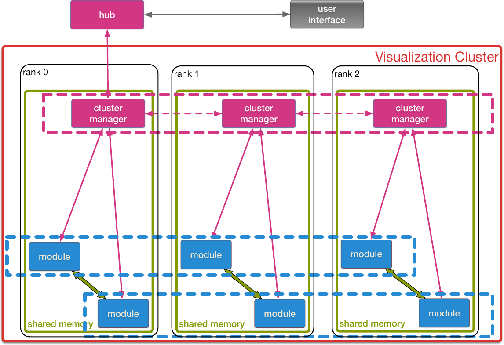
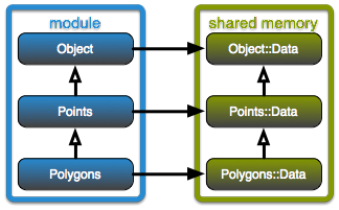
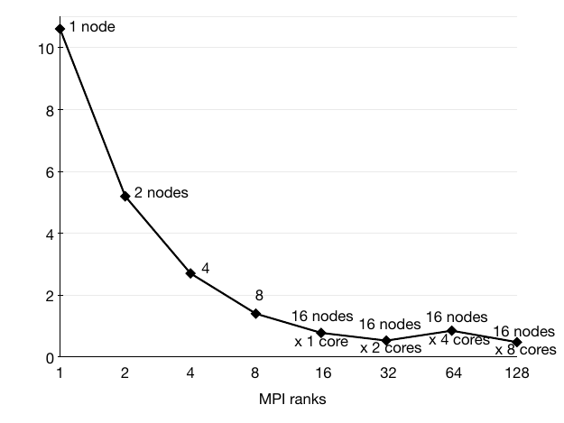
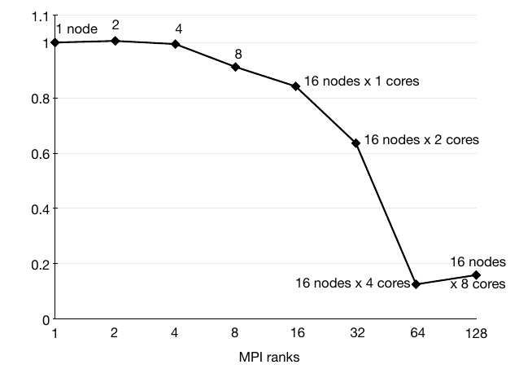

# The Architecture of Vistle, a Scalable Distributed Visualization System

This is an updated and extended version of
*Aumüller M. (2015) The Architecture of Vistle, a Scalable Distributed Visualization System. In: Markidis S., Laure E. (eds) Solving Software Challenges for Exascale. EASC 2014. Lecture Notes in Computer Science, vol 8759. Springer, Cham*,
(DOI: [10.1007/978-3-319-15976-8_11](https://doi.org/10.1007/978-3-319-15976-8_11),
available at [link.springer.com](http://link.springer.com)).

*Abstract:*
> Vistle is a scalable distributed implementation of the visualization pipeline.
> Modules are realized as MPI processes on a cluster.
> Within a node, different modules communicate via shared memory.
> TCP is used for communication between clusters.

> Vistle targets especially interactive visualization in immersive virtual environments.
> For low latency, a combination of parallel remote and local rendering is possible.

## Overview
[Vistle](https://github.com/vistle/vistle) is a modular and extensible implementation
of the visualization pipeline (Moreland, 2013[^pipelines]).
It integrates simulations on supercomputers, post-processing and parallel interactive
visualization in immersive virtual environments.
It is designed to work distributed across multiple clusters.
The objective is to provide a highly scalable system, exploiting data,
task and pipeline parallelism in hybrid shared and distributed memory environments
with acceleration hardware.
Domain decompositions used during simulation shall be reused for visualization
as far as possible for minimizing data transfer and I/O.

A Vistle work flow consists of several processing modules,
each of which is a parallel MPI program that uses OpenMP within nodes.
Shared memory is used for transfering data between modules within a single node,
MPI within a cluster, TCP across clusters.

## Related Work
Data parallelism is available in several distributed systems based on the
visualization pipeline:
[VisIt](https://visit.llnl.gov/) (Ahern et al., 2011[^visit])
and [ParaView](https://www.paraview.org) (Squillacote, 2008[^paraview]) rely on algorithms
implemented by [VTK](https://vtk.org) (Schroeder et al., 2006[^vtk]) for many of their modules,
while EnSight (Frank et al., 2012[^ensight]) has dedicated implementations.
They all implement a client-server architecture, which only allows for restricted distributed processing:
data objects can travel from one remote cluster server to a local display client system,
but they cannot be routed between remote servers in an arbitrary order.
Modules share a single address space on each node,
which allows for embedding the complete visualization
tool within the simulation application (Whitlock et al., 2011[^coupling]).

Vistle is designed as a successor to [COVISE](https://www.hlrs.de/covise) (Wierse et al., 1994[^covise]).
Already COVISE implements a fully distributed visualization pipeline:
modules running on arbitrary systems can be chained together in any order.
Each module is mapped to a separate operating system process.
Data objects to be transfered to other modules are created in shared memory.
They are transferred as needed to other systems transparently to the module programmer.
Because of its multi-process architecture, task parallelism is inherent to the system.
The most significant short-coming is the lack of data-parallelism in distributed memory systems.
COVISE has a strong focus on simulation steering, visualization and interaction in immersive virtual
environments and supports collaboration betweeen desktop and VR systems.
Its render component [OpenCOVER](https://www.hlrs.de/opencover)
(Rantzau et al., 1998[^cover]) builds on [OpenSceneGraph](http://www.openscenegraph.org).

## Process Model

### Multi-process Model With One MPI Process Per Module
In Vistle, modules in the visualization pipeline are realized as individual MPI processes.
In order for the shared memory mechanism to work, equivalent ranks of
different processes have to be placed on the same host.
Initially, `MPI_Comm_spawn_multiple` was used for controlling on which hosts they are started,
but it has proven to be difficult to realize that in a portable manner.
Now we use `mpirun` for spawning independent MPI jobs on the same nodes.
The figure shows the process layout within a cluster.

 
*Process layout, control flow and data flow within a single cluster:
controller and modules are realized as MPI processes.
Within a node, shared memory queues are used to route control messages through the
controller; if necessary, they are routed via MPI through rank 0 of the
controller to other ranks.
Down-stream modules retrieve their input data from shared memory after
being passed an object handle.*

The decision for multiple processes instead of multiple threads was made in order
to decouple MPI communication in different
stages of the pipeline without requiring a multi-thread aware MPI implementation.

This mode of operation is selected at compile-time by enabling the
CMake option `VISTLE_MULTI_PROCESS`.
On systems where the VR renderer OpenCOVER is required, this mode has to be used,
as it is not possible to run more than one instance of OpenCOVER within one address space.

### Single-process Model With a One MPI Process
Alternatively, Vistle can be configured to use a single MPI process by disabling
the CMake option `VISTLE_MULTI_PROCESS`.
As modules execute simultaneously on dedicated threads,
this requires an MPI implementation that supports `MPI_THREAD_MULTIPLE`.
This is the only mode of operation possible on
[Hazel Hen](https://www.hlrs.de/systems/cray-xc40-hazel-hen/), the Cray XC40 system at HLRS.

### Additional Parallelism
Within individual nodes, OpenMP is used to exploit all available cores.
We work on implementing the most important algorithms with the parallel
building blocks supplied by [Thrust](https://thrust.github.io)
in order to achieve code and performance portability across OpenMP and
CUDA accelerators.
We hope that this reimplementation provides speed-ups for
unstructured meshes of the same magnitude as
has been achieved in PISTON (Lo et al., 2012[^piston]) for structured grids.

## Data Management

All data objects are created in shared memory managed by
[Boost.Interprocess](https://www.boost.org/doc/libs/release/doc/html/interprocess.html).
This minimizes the communication overhead and data replication necessary for
Vistle's multi-process model.
As the function pointers stored in the virtual function table of C++ classes are valid
only within the address space of a single process,
virtual methods cannot be called for objects residing in shared memory.
For the class hierarchy of shared memory data objects, there is a parallel
hierarchy of proxy accessor objects, as shown in the figure.
Polymorphic behavior is restored by creating a corresponding proxy object
within each process accessing a shared memory object.
Life time of data objects is managed with reference counting.
Caching of input objects for modules is implemented by simply keeping a
reference to the objects.

 
*Parallel class hierarchies for data objects residing in shared memory
and accessor objects providing polymorphic behavior for modules.*

The most important component of data objects are scalar arrays.
They provide an interface compatible with STL's `vector` (Josuttis, 2012[^stl]).
As an optimization for the common case of storing large arrays of scalar values,
they are not initialized during allocation,
as most often these default values would have to be overwritten immediately.
These arrays are reference counted individually, such that shallow copies of data
objects are possible and data arrays can be referenced from several data
objects.
This allows to e.g. reuse the coordinate array for both an unstructured
volume grid and a corresponding boundary surface.

Data objects are created by modules,
modification of data objects is not possible after they are published to other modules.
The only exception to this rule is that any module can attach other objects to
arbitrary objects.
This is used to tie them to acceleration structures,
such as the celltree (Garth et al., 2010[^celltree]) for fast cell search within unstructured grids,
that can be reused across modules.

Data objects can be transmitted between nodes (i.e. MPI ranks), but we try
to avoid this overhead:
we assume that in general the overhead of load balancing is not warranted
as most visualization algorithms are fast and
as the imbalances vary with the parameterization of the algorithm (e.g. iso value).

Objects carry metadata such as their name, source module, age, simulation
time, simulation iteration, animation time step,
and the number of the partition for domain decomposed data.
Additionally, textual attributes can be attached to objects.
This provides flexibility to e.g. manage hierarchic object groups or collections
and to attach shaders to objects.

The hierarchy of data object classes comprises object types for structured and unstructured grids,
collections of polygons and triangles, lines and points,
celltrees as well as scalar and
vector data mapped onto these geometric structures.
Users can extend the system with their own data types.
Shallow object copies are supported, e.g. for modules which just make changes to object metadata.
Objects from previous pipeline runs can be cached by retaining a reference,
so that not the complete pipeline has to be reexecuted if only some module parameters change.

## Control Flow and Message System

The central instance for managing the execution on each cluster is the hub,
which connects to the cluster manager on rank 0.
Its main task
is to handle events and manage control flow between modules.
Messages for this purpose are rather small and have a fixed maximum size.
MPI is used for transmitting them from the cluster manager's rank 0 to other ranks.
Within a rank, they are forwarded using shared memory message queues.
The cluster manager polls MPI and message queues in shared memory on the main thread.
TCP is used for communicating between hub and cluster manager and user interfaces and other clusters.
They are used to launch modules,
trigger their execution,
announce the availability of newly created data objects,
transmit parameter values
and communicate the execution state of a module.

Work flow descriptions are stored as Python scripts and are interpreted by the hub.

## Modules

Modules are implemented by deriving from the module base class.
During construction, a module should define its input and output ports as well
as its parameters.
For every tuple of objects received at its inputs,
the `compute()` method of a module is called.
By default, `compute()` is only invoked on the node where the data object
has been received.
In order to avoid synchronization overhead,
MPI communication is only possible if a module explicitly opts in to
parallel invocation of `compute()` on all ranks.
If only a final reduction operation has to be performed after all
blocks of a data set have been processed, a `reduce()` method can be
implemented by modules.
Compared to parallel invocation of `compute()`, this has lower
synchronization overhead.

## User Interface
User interfaces attach to or detach from a Vistle session dynamically at
run-time.
User interfaces connect to the controller's rank 0.
For attaching to sessions started as a batch job on a system with limited
network connectivity, the controller will connect to a proxy at a known location,
where user interfaces can attach to instead.
Upon connection, the current state of the session is communicated to the user
interface.
From then on, the state is tracked by observing Vistle messages that induce
state changes.
An arbitrary number of UIs can be attached at any time, thus facilitating
simple collaboration.
Graphical and command line/scripting user interfaces can be mixed at will.
Their state always remains synchronized.

Graphical UIs provide an explicit representation of data flow: this makes the
configured visualization pipeline easy to understand.

 
*Configuration of a visualization workflow in Vistle's graphical user interface,
the right part shows the parameters of the selected module.*

## Rendering
Vistle is geared towards immersive virtual environments, where low latency is
very important.
In order to allow for using the COVISE VR render system
[OpenCOVER](https://www.hlrs.de/opencover) also with Vistle,
it was refactored so that visualization systems can be coupled via plug-ins.
Visualization parameters such as positioning of cutting planes, iso values and seed points for streamlines
can be manipulated from within the virtual environment.
Changes in classification of scalar values are visible instantaneously.
Large data sets can be displayed with sort-last parallel rendering and depth
compositing implemented using IceT (Moreland et al., 2011[^icet]).
To facilitate access to remote HPC resources, a combination of local and
parallel remote rendering called remote hybrid rendering (Wagner et al., 2012[^hybrid-remote])
is available to decouple interaction from remote rendering.
There is also the ray caster DisCOVERay based on [Embree](http://embree.org)
(Wald et al., 2014[^embree]) running entirely on the CPU,
which enables access to remote resources without GPUs.

## First Results
Performance of the system was evaluated with the visualization of
the simulation of a pump turbine.
The simulation was conducted by the
[Institute of Fluid Mechanics and Hydraulic Machinery](https://www.ihs.uni-stuttgart.de)
at the University of Stuttgart with [OpenFOAM](https://openfoam.org) on 128 processors.
Accordingly, the data set was decomposed into 128 blocks.
This also limits the amount of parallelism that can be reached.
These figures show runtime and parallel efficiency.
Isosurface extraction is interactive at rates of more than 20/s
and runtime does not increase until full parallelism is reached.

*Isosurface extraction on 13 timesteps of 5.8 million moving unstructured cells,
runtime in s.*

*Isosurface extraction on 13 timesteps of 5.8 million moving unstructured cells,
parallel efficiency.*

While this suggests that the approach is suitable for in-situ visualization,
the impact on the performance of a simulation will have to be assessed specifically
for each case:
often, the simulation will have to be suspended while its state is captured,
the visualization might compete for memory with the simulation,
and the visualization will claim processor time slices from the simulation as
it will be scheduled on the same cores.
However, these costs are only relevant when in-situ visualization is
actively used, as Vistle's modular design requires only a small component for 
interfacing with the visualization tool to remain in memory all the time.

## Current Status and Future Work
The next mile stones that we aim to achieve are to
couple the system to OpenFOAM.
Additionally, the scalability of the system will be improved by making better
use of OpenMP and acceleration hardware.

## Acknowledgments
This work has been supported in part by the CRESTA project that has received
funding from the European Community’s Seventh Framework Programme
(ICT-2011.9.13).

[^visit]: Ahern, S., Childs, H., Brugger, E., Whitlock, B., Meredith, J.: VisIt: an end-user tool for visualizing and analyzing very large data. In: Proceedings of SciDAC (2011)
[^ensight]: Frank, R., Krogh, M.F.: The EnSight visualization application. In: Bethel, E.W., Childs, H., Hansen, C. (eds.) High Performance Visualization-Enabling Extreme-Scale Scientific Insight, pp. 429–442. Chapman & Hall/CRC, Salt Lake City (2012)
[^celltree]: Garth, C., Joy, K.I.: Fast, memory-efficient cell location in unstructured grids for visualization. IEEE Trans. Vis. Comput. Graph. 16(6), 1541–1550 (2010)
[^stl]: Josuttis, N.M.: The C++ Standard Library. A Tutorial and Reference, 2nd edn. Addison-Wesley Professional, Boston (2012)
[^piston]: Lo, L.T., Ahrens, J., Sewell, C.: PISTON: a portable cross-platform framework for data-parallel visualization operators. In: EGPGV, pp. 11–20 (2012)
[^pipelines]: Moreland, K.: A survey of visualization pipelines. IEEE Trans. Vis. Comput. Graph. 19(3), 367–378 (2013).
[^icet]: Moreland, K., Kendall, W., Peterka, T., Huang, J.: An image compositing solution at scale. In: 2011 International Conference for High Performance Computing, Networking, Storage and Analysis (SC), pp. 1–10 (2011)
[^cover]: Rantzau, D., Lang, U.: A scalable virtual environment for large scale scientific data analysis. Future Gener. Comput. Syst.-Int. J. Grid Comput. Theory Methods Appl. 14(3–4), 215–222 (1998)
[^vtk]: Schroeder, W., Martin, K., Lorensen, B.: The Visualization Toolkit. An Object-Oriented Approach to 3D Graphics. Kitware Inc., Clifton Park (2006)
[^paraview]: Squillacote, A.: The Paraview Guide. Kitware Inc., Clifton Park (2008)
[^hybrid-remote]: Wagner, C., Flatken, M., Chen, F., Gerndt, A., Hansen, C.D., Hagen, H.: Interactive hybrid remote rendering for multi-pipe powerwall systems. In: Geiger, C., Herder, J., Vierjahn, T. (eds.) Virtuelle und Erweiterte Realität - 9. Workshop der GI-Fachgruppe VR/AR, pp. 155–166. Shaker Verlag, Aachen (2012)
[^coupling]: Whitlock, B., Favre, J.M., Meredith, J.S.: Parallel in situ coupling of simulation with a fully featured visualization system. In: EGPGV, pp. 101–109, April 2011
[^covise]: Wierse, A., Lang, U., Rühle, R.: A system architecture for data-oriented visualization. In: Lee, J.P., Grinstein, Georges G. (eds.) Visualization-WS 1993. LNCS, vol. 871, pp. 148–159. Springer, Heidelberg (1994).
[^embree]: Wald, I., Woop, S., Benthin, C., Johnson, G. S., Ernst, M.: Embree: a kernel framework for efficient CPU ray tracing, ACM Transactions on Graphics (2014)

